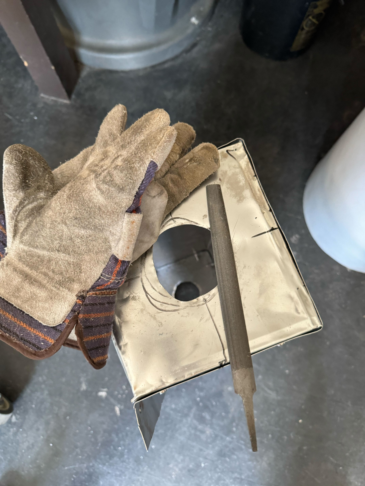

Makinge a tube furnace for a research project! Still a WIP though.

A Tube furnace is a specialized furnace in which a quartz tube is heated to over 1000 degrees celsius. Designing one to be made with an Arduino.

